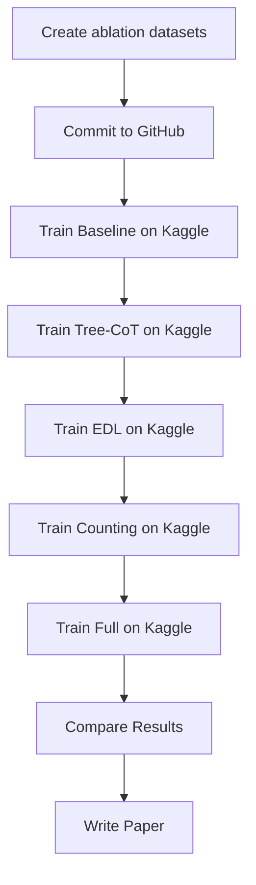

# Ablation Study Implementation Summary

## ✅ **Files Created:**

### **1. Scripts:**
- `scripts/create_ablation_datasets.py` - Tạo ablation datasets với seed cố định

### **2. YAML Configs (train/ablation/):**
- `ablation_baseline_8000.yaml` - Baseline (8000 crohme_train)
- `ablation_tree_8000.yaml` - Baseline + Tree-CoT (4000+4000)
- `ablation_edl_8000.yaml` - Baseline + EDL (4000+2000+2000)
- `ablation_counting_8000.yaml` - Baseline + Counting (4000+4000)
- `ablation_full_8000.yaml` - Full (4000+1000+1000+1000+1000)

### **3. Dataset Registration:**
- Updated `train/LLaMA-Factory/data/dataset_info.json` with 5 ablation datasets

### **4. Documentation:**
- `ABLATION_GUIDE.md` - Hướng dẫn chi tiết ablation study
- `NOTEBOOK_V7_GUIDE.md` - Hướng dẫn sử dụng notebook v7

---

## 🚀 **Next Steps:**

### **Step 1: Tạo ablation datasets (Local machine)**

```bash
cd "D:\Thac Si\HK2\test-unimer"

# Chạy script tạo datasets
python scripts/create_ablation_datasets.py --seed 42 --output-dir data/ablation
```

**Expected output:**
```
data/ablation/
├── ablation_baseline_8000.parquet
├── ablation_tree_8000.parquet
├── ablation_edl_8000.parquet
├── ablation_counting_8000.parquet
└── ablation_full_8000.parquet
```

---

### **Step 2: Commit và push lên GitHub**

```bash
git add train/ablation/*.yaml
git add train/LLaMA-Factory/data/dataset_info.json
git add scripts/create_ablation_datasets.py
git add data/ablation/*.parquet  # Nếu file không quá lớn
git add ABLATION_GUIDE.md NOTEBOOK_V7_GUIDE.md
git add ABLATION_SUMMARY.md

git commit -m "Add ablation study framework

- Created 5 ablation configs with fixed sampling ratios
- Added script to generate reproducible ablation datasets
- Registered ablation datasets in dataset_info.json
- Added comprehensive documentation

Ablation configs:
- baseline_8000: 8000 crohme_train
- tree_8000: 4000 crohme_train + 4000 tree
- edl_8000: 4000 crohme_train + 2000 error_find + 2000 error_fix
- counting_8000: 4000 crohme_train + 4000 can
- full_8000: 4000 crohme_train + 1000 tree + 1000 can + 1000 error_find + 1000 error_fix

All configs use seed=42 for reproducibility."

git push
```

---

### **Step 3: Điều chỉnh notebook v7**

**Cell 1 (Config) - Thêm comment hướng dẫn:**
```python
# ====== ABLATION MODE ======
# Uncomment one of these for ablation study:
# BASE_YAML_CONFIG = "train/ablation/ablation_baseline_8000.yaml"
# BASE_YAML_CONFIG = "train/ablation/ablation_tree_8000.yaml"
# BASE_YAML_CONFIG = "train/ablation/ablation_edl_8000.yaml"
# BASE_YAML_CONFIG = "train/ablation/ablation_counting_8000.yaml"
# BASE_YAML_CONFIG = "train/ablation/ablation_full_8000.yaml"

# ====== NORMAL MODE ======
BASE_YAML_CONFIG = "train/Uni-MuMER-train.yaml"
```

**Cell 5 (Runtime YAML Override) - Thêm logic phân biệt:**
```python
# Runtime YAML Override
from scripts.runtime_yaml import prepare_runtime_yaml

USE_RUNTIME_YAML_OVERRIDE = True

# Check if using ablation config
IS_ABLATION = "ablation" in BASE_YAML_CONFIG

if IS_ABLATION:
    # ABLATION MODE: Only override hyperparameters
    # DO NOT override dataset or max_samples!
    YAML_OVERRIDES = {
        "num_train_epochs": 1,  # Quick test (original: 3)
        "per_device_train_batch_size": 2,
        "gradient_accumulation_steps": 64,
        "learning_rate": 1.0e-4,
        "logging_steps": 1,
        "save_steps": 20,
        # NO dataset override!
        # NO max_samples override!
    }
else:
    # NORMAL MODE: Can override dataset
    YAML_OVERRIDES = {
        "dataset": "parquet_crohme_train",
        "max_samples": 5,
        "num_train_epochs": 3,
        "per_device_train_batch_size": 2,
        "gradient_accumulation_steps": 64,
        "learning_rate": 1.0e-4,
        "lora_rank": 64,
        "logging_steps": 1,
        "save_steps": 20,
        "output_dir": "saves/qwen2.5_vl-3b/qlora/sft/standred/uni-mumer_qlora",
        # ... other overrides
    }

# Prepare runtime YAML
YAML_CONFIG, OUTPUT_DIR, YAML_DATA = prepare_runtime_yaml(
    project_dir=PROJECT_DIR,
    base_yaml_config=BASE_YAML_CONFIG,
    runtime_yaml_config=RUNTIME_YAML_CONFIG,
    use_override=USE_RUNTIME_YAML_OVERRIDE,
    overrides=YAML_OVERRIDES,
    strict_keys=True,
)
```

---

### **Step 4: Test workflow**

**A. Test tạo datasets (Local):**
```bash
python scripts/create_ablation_datasets.py --seed 42 --output-dir data/ablation
```

**B. Test training 1 config (Kaggle):**
1. Mở notebook v7
2. Set `BASE_YAML_CONFIG = "train/ablation/ablation_baseline_8000.yaml"`
3. Run notebook
4. Kiểm tra training logs và test results

**C. Train all 5 configs (Kaggle - 5 runs):**
Mỗi lần:
- Đổi `BASE_YAML_CONFIG`
- Rerun notebook
- Save results

**D. Compare results:**
```bash
# Download tất cả test results từ DagsHub
# So sánh metrics giữa 5 configs
```

---

## 📊 **Expected Workflow:**



---

## ⚠️ **Important Checks:**

### **Before training:**
- [ ] Ablation datasets created (`data/ablation/*.parquet`)
- [ ] Datasets registered in `dataset_info.json`
- [ ] All YAML configs have `seed: 42`
- [ ] Notebook v7 has ablation logic

### **During training:**
- [ ] Not overriding `dataset` for ablation configs
- [ ] Not overriding `max_samples` for ablation configs
- [ ] Using same test set (CROHME 2014, 2016, 2019)

### **After training:**
- [ ] All 5 configs trained successfully
- [ ] Test results collected for all configs
- [ ] Metrics compared fairly

---

## 🎯 **Success Criteria:**

Ablation study is successful when:
1. ✅ All configs have exactly 8000 training samples
2. ✅ All configs trained with same hyperparameters (except data composition)
3. ✅ All configs tested on same test sets
4. ✅ Results are reproducible with same seed
5. ✅ Can measure contribution of each component (Tree-CoT, EDL, Counting)

---

## 📝 **Files Modified:**

| File | Status | Description |
|------|--------|-------------|
| `scripts/create_ablation_datasets.py` | ✅ Created | Dataset generation script |
| `train/ablation/*.yaml` | ✅ Created | 5 ablation configs |
| `train/LLaMA-Factory/data/dataset_info.json` | ✅ Modified | Registered ablation datasets |
| `ABLATION_GUIDE.md` | ✅ Created | Comprehensive guide |
| `NOTEBOOK_V7_GUIDE.md` | ✅ Created | Notebook usage guide |
| `uni-mumer-kaggle-dagshub v7.ipynb` | ⏳ To modify | Add ablation logic |

---

## 📚 **Documentation:**

- **ABLATION_GUIDE.md** - Read this for full ablation study workflow
- **NOTEBOOK_V7_GUIDE.md** - Read this for notebook v7 usage
- **This file (ABLATION_SUMMARY.md)** - Quick reference for what was done

---

**Implementation completed! Ready to run ablation study.** 🎉
