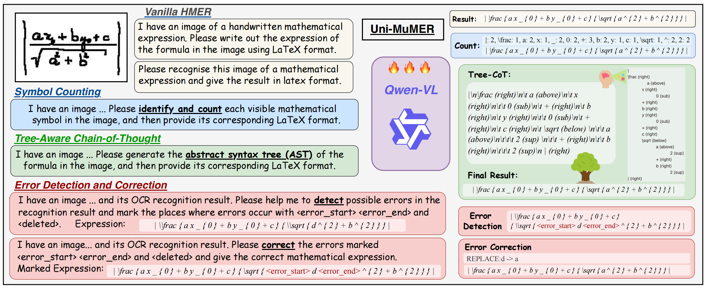
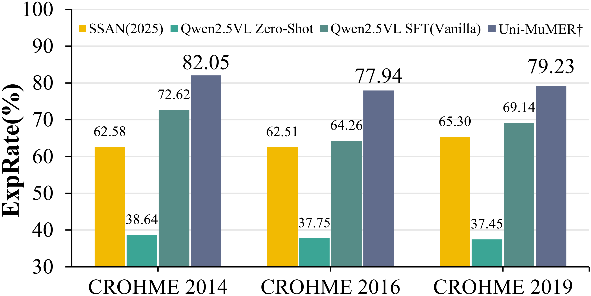

# Uni-MuMER: Fine-tuning Thống nhất Đa nhiệm của Mô hình Vision-Language cho Nhận dạng Biểu thức Toán học Viết tay

<p align="center">
    <a href="https://arxiv.org/abs/2505.23566"></a>
    <a href="https://huggingface.co/collections/phxember/uni-mumer-68bfba4747e9289232f3d89e"></a>
</p>

## Mô tả

Chúng tôi giới thiệu Uni-MuMER, một phương pháp fine-tune hoàn toàn mô hình Qwen2.5-VL-3B cho tác vụ HMER mà không thay đổi kiến trúc của nó, hiệu quả trong việc tích hợp kiến thức chuyên ngành vào một framework tổng quát. Phương pháp của chúng tôi tích hợp ba tác vụ dựa trên dữ liệu: Tree-Aware Chain-of-Thought (Tree-CoT) cho lập luận không gian có cấu trúc, Error-Driven Learning (EDL) để giảm nhầm lẫn giữa các ký tự trực quan tương tự, và Symbol Counting (SC) để cải thiện tính nhất quán trong nhận dạng các biểu thức dài.



Các thí nghiệm trên dataset CROHME và HME100K cho thấy Uni-MuMER đạt được hiệu suất state-of-the-art mới, vượt qua mô hình chuyên biệt nhẹ tốt nhất SSAN 16.31% và VLM hàng đầu Gemini2.5-flash 24.42% trong thiết lập zero-shot.



## 📢 Cập nhật

- **2025-09-18**: Công trình này được chấp nhận tại NeurIPS 2025 với danh hiệu Spotlight (688/21575).
- **2025-09-09**: Phát hành dataset ([Uni-MuMER-Data](https://huggingface.co/datasets/phxember/Uni-MuMER-Data) và [valid/test data](https://drive.google.com/drive/folders/1T8a3WxICZVl1NJ99hu9tuuqqNZoxGhXq?usp=sharing)) và mã nguồn training.
- **2025-06-02**: Phát hành trọng số mô hình và script inference.

## 🔧 Cài đặt

### Yêu cầu hệ thống
- Ubuntu (hoặc Linux tương thích)
- GPU với CUDA (khuyến nghị)
- Conda hoặc Miniconda
- Python 3.10+

### Bước 1: Tạo môi trường conda

```bash
conda create -n unimumer python=3.10 -y
conda activate unimumer
```

### Bước 2: Cài đặt PyTorch với CUDA

```bash
# Kiểm tra phiên bản CUDA
nvidia-smi

# Cài PyTorch với CUDA (thay đổi theo phiên bản CUDA của bạn)
# Ví dụ: CUDA 12.8
conda install pytorch torchvision torchaudio pytorch-cuda=12.8 -c pytorch -c nvidia -y

pip install torchvision

# Hoặc CUDA 11.8
# conda install pytorch torchvision torchaudio pytorch-cuda=11.8 -c pytorch -c nvidia -y
```

### Bước 3: Cài đặt dependencies

```bash
pip install -r requirements.txt
```

### Bước 4: Giải nén dataset (nếu có)

```bash
unzip data.zip
```

## 🏃 Inference (Dự đoán)

**Tất cả inference đều sử dụng 4-bit quantization để tiết kiệm VRAM (~50% so với full precision).**

### Merge Checkpoint để Inference

Sau khi train, bạn cần merge adapter từ checkpoint vào base model để có thể inference:

```bash
conda activate unimumer

# Merge checkpoint-1
python scripts/merge_checkpoint.py \
    --base-model ./Uni-MuMER-Qwen2.5-VL-3B \
    --checkpoint saves/qwen2.5_vl-3b/qlora/sft/standred/uni-mumer_qlora/checkpoint-1 \
    --output ./Uni-MuMER-Qwen2.5-VL-3B-checkpoint1

# Hoặc merge checkpoint-2
python scripts/merge_checkpoint.py \
    --base-model ./Uni-MuMER-Qwen2.5-VL-3B \
    --checkpoint saves/qwen2.5_vl-3b/qlora/sft/standred/uni-mumer_qlora/checkpoint-2 \
    --output ./Uni-MuMER-Qwen2.5-VL-3B-checkpoint2
```

**Tham số:**
- `--base-model`: Thư mục chứa base model (có `model-00001-of-00002.safetensors`, `model-00002-of-00002.safetensors`)
- `--checkpoint`: Thư mục checkpoint chứa `adapter_model.safetensors`
- `--output`: Thư mục lưu model đã merge

### Chạy Inference cho một dataset *****

**Lưu ý:** Script inference sử dụng vLLM để tăng tốc độ inference. Đảm bảo chạy từ thư mục gốc dự án.

```bash
conda activate unimumer

# Chuyển về thư mục gốc dự án
cd ~/Uni-MuMER-project

# Ví dụ: CROHME với model đã merge
python scripts/vllm_infer.py \
    --input-dir data/CROHME/prompts \
    --output-dir data/CROHME/results \
    --model ./Uni-MuMER-Qwen2.5-VL-3B-checkpoint1 \
    --batch-size 1 \
    --max-tokens 2048

# Ví dụ: CROHME2023
python scripts/vllm_infer.py \
    --input-dir data/CROHME2023/prompts \
    --output-dir data/CROHME2023/results \
    --model ./Uni-MuMER-Qwen2.5-VL-3B-checkpoint1 \
    --batch-size 1 \
    --max-tokens 2048

# Ví dụ: HME100K
python scripts/vllm_infer.py \
    --input-dir data/HME100K/prompts \
    --output-dir data/HME100K/results \
    --model ./Uni-MuMER-Qwen2.5-VL-3B-checkpoint1 \
    --batch-size 1 \
    --max-tokens 2048
```

### Chạy Inference cho tất cả datasets

```bash
conda activate unimumer

# Chuyển về thư mục gốc dự án
cd ~/Uni-MuMER-project

# Tạo script đơn giản để chạy tất cả
for dataset in CROHME CROHME2023 HME100K Im2LaTeXv2 MathWriting MNE; do
    if [ -d "data/$dataset/prompts" ]; then
        echo "Processing $dataset..."
        python scripts/vllm_infer.py \
            --input-dir data/$dataset/prompts \
            --output-dir data/$dataset/results \
            --model ./Uni-MuMER-Qwen2.5-VL-3B-checkpoint1 \
            --batch-size 1 \
            --max-tokens 2048
    fi
done
```

### Tham số Inference

- `--model`: Đường dẫn đến model đã merge (bắt buộc, ví dụ: `./Uni-MuMER-Qwen2.5-VL-3B-checkpoint1`)
- `--input-dir`: Thư mục chứa file JSON prompts (bắt buộc, ví dụ: `data/CROHME/prompts`)
- `--output-dir`: Thư mục lưu kết quả (bắt buộc, ví dụ: `data/CROHME/results`)
- `--batch-size`: Batch size cho vLLM (mặc định: 32768, có thể giảm xuống 1 nếu thiếu VRAM)
- `--max-tokens`: Số token tối đa để generate (mặc định: 2048)
- `--temperature`: Temperature cho sampling (mặc định: 0.2)
- `--top-p`: Top-p sampling (mặc định: 0.8)
- `--suffix`: Suffix cho file output (mặc định: `_pred`)

### Xem kết quả

```bash
# Xem kết quả CROHME
cat data/CROHME/results/crohme_2014_results.txt
cat data/CROHME/results/crohme_2016_results.txt
cat data/CROHME/results/crohme_2019_results.txt

# Xem kết quả HME100K
cat data/HME100K/results/hme100k_test_results.txt
```

## 🏋️ Training

**Training sử dụng QLoRA + 4-bit quantization để tiết kiệm VRAM (~50-70% so với full precision).**

### Cài đặt LLaMA-Factory

Training phụ thuộc vào [LLaMA-Factory](https://github.com/hiyouga/LLaMA-Factory):

```bash
conda activate unimumer

# Clone LLaMA-Factory (nếu chưa có)
if [ ! -d "train/LLaMA-Factory" ]; then
    git clone https://github.com/hiyouga/LLaMA-Factory.git train/LLaMA-Factory
fi

# Cài đặt dependencies cho training
cd train/LLaMA-Factory
pip install -e .
cd ../..
```

### Training Data

**Training data được tự động tải từ HuggingFace khi training.**

Cấu hình đã được thiết lập để tự động download datasets từ `phxember/Uni-MuMER-Data` khi chạy training. Lần đầu chạy sẽ mất vài phút để download, sau đó sẽ được cache.

**Lưu ý:**
- Cần kết nối internet để download datasets
- Datasets sẽ được cache trong `~/.cache/huggingface/`
- Nếu cần, có thể login HuggingFace: `huggingface-cli login`

### Chạy Training

```bash
conda activate unimumer

# Chạy training với QLoRA + 4-bit quantization
# Datasets sẽ được tự động download từ HuggingFace
llamafactory-cli train train/Uni-MuMER-train.yaml
```

### Cấu hình Training

File `train/Uni-MuMER-train.yaml` đã được cấu hình với:
- **QLoRA + 4-bit quantization**: Giảm VRAM usage đáng kể
- **quantization_bit: 4**: Sử dụng 4-bit quantization
- **quantization_type: nf4**: NormalFloat4 quantization
- **lora_rank: 64**: LoRA rank
- **lora_alpha: 16**: LoRA alpha
- **per_device_train_batch_size: 2**: Batch size phù hợp với quantization

**Ưu điểm của QLoRA:**
- Giảm VRAM usage ~50-70% so với full precision training
- Có thể train trên GPU nhỏ hơn (ví dụ: RTX 3090, A6000)
- Vẫn giữ được hiệu suất tốt
- Chỉ train LoRA adapters, không cần lưu toàn bộ model weights

## ⚙️ 4-bit Quantization

Tất cả inference và training đều sử dụng 4-bit quantization với BitsAndBytes để tiết kiệm VRAM:

### Cấu hình Quantization

```python
BitsAndBytesConfig(
    load_in_4bit=True,
    bnb_4bit_use_double_quant=True,  # Double quantization để giảm thêm memory
    bnb_4bit_quant_type="nf4",        # NormalFloat4 quantization
    bnb_4bit_compute_dtype=torch.bfloat16  # Compute dtype
)
```

### Lợi ích

- **Model size**: Giảm từ ~3GB xuống ~1.5GB
- **VRAM usage (Inference)**: Giảm từ ~6GB xuống ~2-3GB
- **VRAM usage (Training)**: Giảm từ ~60-80GB xuống ~20-30GB
- **Độ chính xác**: Vẫn giữ được độ chính xác tốt

## ⚠️ Troubleshooting

### Lỗi "bitsandbytes not found"

```bash
pip install bitsandbytes>=0.41.0
```

### Lỗi OOM (Out of Memory)

1. **Giảm batch size**:
   ```bash
   --batch-size 1
   ```

2. **Giảm max tokens**:
   ```bash
   --max-tokens 1024
   ```

3. **Clear GPU cache**:
   ```bash
   python -c "import torch; torch.cuda.empty_cache()"
   ```

4. **Kiểm tra processes khác**:
   ```bash
   nvidia-smi
   # Kill processes không cần thiết
```

### Lỗi CUDA không khớp

Kiểm tra và cài lại PyTorch với đúng phiên bản CUDA:
```bash
nvidia-smi  # Kiểm tra phiên bản CUDA
conda install pytorch torchvision torchaudio pytorch-cuda=12.4 -c pytorch -c nvidia -y
```

### Lỗi thiếu module

```bash
conda activate unimumer
pip install -r requirements.txt
```

## 📝 Trích dẫn

Nếu bạn thấy Uni-MuMER hữu ích cho nghiên cứu của mình, vui lòng trích dẫn bài báo của chúng tôi:

```bibtex
@article{li2025unimumer,
  title = {Uni-MuMER: Unified Multi-Task Fine-Tuning of Vision-Language Model for Handwritten Mathematical Expression Recognition},
  author = {Li, Yu and Jiang, Jin and Zhu, Jianhua and Peng, Shuai and Wei, Baole and Zhou, Yuxuan and Gao, Liangcai},
  year = {2025},
  journal={arXiv preprint arXiv:2505.23566},
}
```

## 🙏 Lời cảm ơn

Cảm ơn các dự án sau:

- [CoMER](https://github.com/Green-Wood/CoMER)
- [PosFormer](https://github.com/SJTU-DeepVisionLab/PosFormer)
- [TAMER](https://github.com/qingzhenduyu/TAMER)
- [LLaMA-Factory](https://github.com/hiyouga/LLaMA-Factory)
- [MathNet](https://github.com/felix-schmitt/MathNet)
